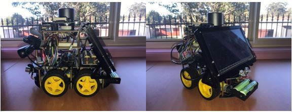
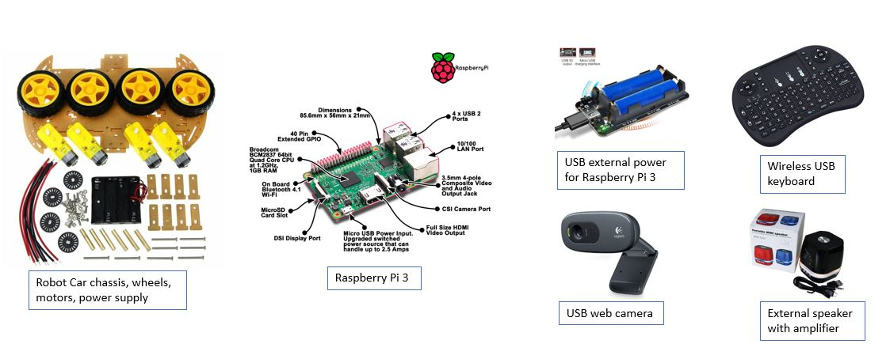
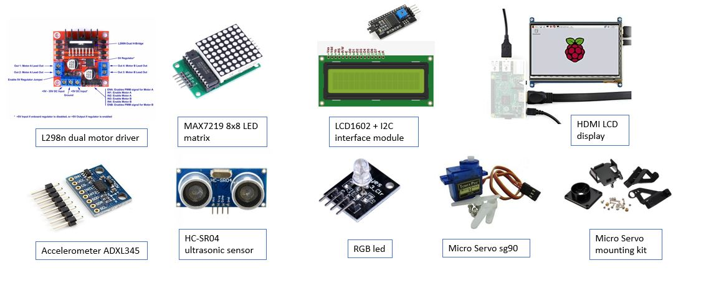
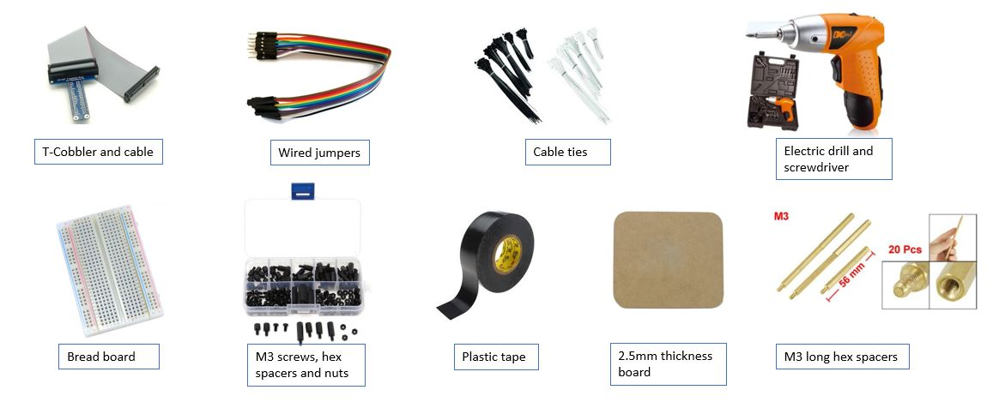
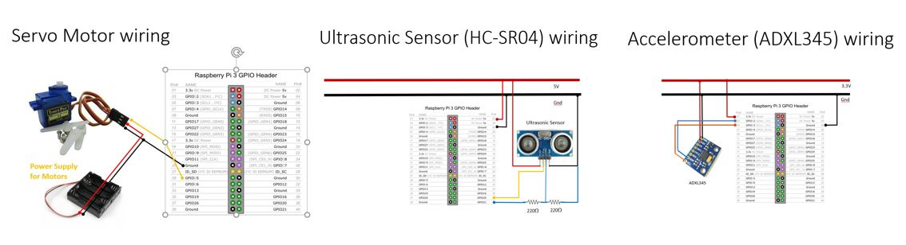
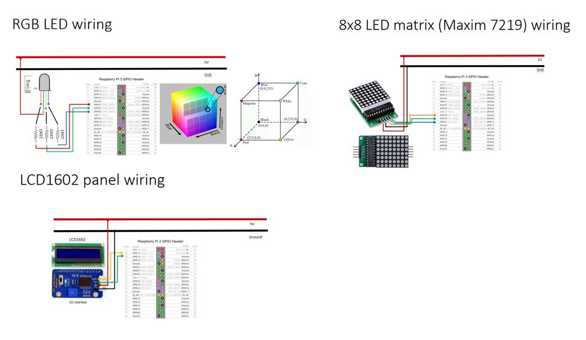

robot_car_s
## Robot Car (Raspberry Pi 3 - simple)

The objective of setup the Raspberry Pi Robot Car is to demonstrate
the use of Python language through Raspberry Pi to control robots, 
visual and audio responses and display information. 
Different types of common hardware are used to enable movement 
(motors and servo), computer vision (USB webcam), audio response 
(sound and speaker), display information (LED matrix and LCD display) 
and sensor to detect environment changes (distance sensor and accelerometer)




## Getting Started
**Physical setup (components):**
* Robot Car chassis, wheels, motors, power supply
 and circuit control board (L298N) for movement
* Single-board computer (Raspberry Pi 3 Model B) to 
run the Python program and control the Raspberry Pi Robot Car
* Separated Power supply for the robot car motors
* Separated Power supply for the Raspberry Pi 3
* Ultrasonic sensor (HC-SR04) to sense the distance
* Accelerometer (ADXL345) to sense the dips, humps, acceleration 
and deceleration
* Servo (sg90) micro-servo to move the HC-SR04 to scan the distance
 between the robot car and obstacles 
 * Mounting kit for the Servo
* RGB led display different colour (RGB led) to signal the status of the robot car
* 8x8 LED matrix (Maxim 7219) to display single character of scrolling message in LEDs
* 16x2 LCD display (lcd 1602 with i2c connection) to display message in 2 rows
* Logitech C310 webcam or equivalent that could be detected by Raspberry Pi 
for OpenCV (Computer Vision) in the future
* Mini-Speaker with amplifier for audio output in the future
* Bread board to connect related hardware together
* T-Cobbler connector and cable
* Wire Jumpers
* Mini On-Off Toggle switch
* 220 ohms resistors
* Mini-size wireless USB keyboard to enter commands in Raspberry Pi and 
control the Robot Car
* HDMI LCD display to show the Raspberry Pi desktop for easy calibration. 
We could use VNC to remote display the Raspberry Pi desktop also





**Wiring the Robot Car**






#### Installing

**Install Python libraries to support the hardware**

* **Install Max7219** python supporting library for Raspberry Pi
    Richard Hull. 2016. Raspberry PI MAX7219 driver. [ONLINE] Available at: 
    https://max7219.readthedocs.io/en/0.2.3/
    1. Follow either options to complete 'Step 1'
        * Option 1:
            ````
            sudo apt-get install python3-dev python3-pip
            sudo pip3 install max7219
            ````
        * Option 2:
            ````
            git clone https://github.com/rm-hull/max7219.git
            cd max7219
            sudo pip3 install -e .
            ````
    2. Follow the specific steps below
        ````
        cd max7219
        sudo apt-get install python3-dev python3-pip
        sudo pip3 install spidev
        sudo python3 setup.py install
        ````
    3. Problem (if applicable): “No module named luma.led.matrix.device”
    
        Force reinstall of the “luma.led.matrix.device” module may need to do so
        ````
        sudo -H pip3 install --upgrade --force-reinstall --ignore-installed luma.led_matrix
        ````
* **Install 16x2 LCD display (lcd1602)** python supporting library for Raspberry Pi
    * Denis Pleic. 2015. RPi_I2C_driver.py [ONLINE] Available at: https://gist.github.com/DenisFromHR/cc863375a6e19dce359d
    * Reference: http://www.circuitbasics.com/raspberry-pi-i2c-lcd-set-up-and-programming/
        ````
        sudo apt-get update
        sudo apt-get install i2c-tools
        sudo apt-get install python3-smbus
        ````
    * Copy the Python driver codes from the link below and save as RPi_I2C_driver.py
    https://gist.github.com/DenisFromHR/cc863375a6e19dce359d/raw/36b82e787450d127f5019a40e0a55b08bd43435a/RPi_I2C_driver.py
     
* **Install Accelerometer (ADXL345) module** python supporting library for Raspberry Pi
    Tony DiCola. 2015. Adafruit_Python_ADXL345. [ONLINE] Available at:  
    https://github.com/adafruit/Adafruit_Python_ADXL345 
    * Follow either options to complete 'Step 1'
        * Option 1:
            ````
            sudo apt-get install git build-essential python3-dev
            cd ~
            git clone https://github.com/adafruit/Adafruit_Python_ADXL345.git
            cd Adafruit_Python_ADXL345
            sudo python setup.py install
            ````
        * Option 2:
            ````
            sudo pip3 install adafruit-adxl345
            ````
* **Install pynput 1.4.2** (https://pypi.org/project/pynput/)
    * install the pynput python library to listen the key pressed
    ````
        pip install pynput
    ````
    * pynput documentation (https://pynput.readthedocs.io/en/latest/)
    
**Use test programs to confirm the Robot Car components are working**

* Use the following Python codes to test under 'test' sub-director:
    * **key_test.py** to test the wireless USB keyboard press
    * **lcd1602_test.py** to test the lcd1602 with I2C connection display
    * **matrix_demo.py** to test the MAX7219 8x8 LED display
    * **motor_test.py** to test car left and right motors operation
    * **rgb_led.py** to test the RGB led display
    * **servo_test.py** to test the micro servo sg90 operation
    * **simpletest.py** to test the ADXL345 accelerometer the yaw-roll-pitch of the car
    * **ultrasonic_HC-SR04.py** to test the HC-SR04 ultrasonic sensor measuring distance

## Running the tests

Use Python 3 IDLE or run python in command line to execute the test programs under 'test'
sub-directory
* Test the wireless keyboard press - **key_test.py**
    ````
        python key_test.py
    ````
    * Press any key in wireless USB keyboard to check the key pressed in the Python Console
    * Press 'ESC' key to exit the program
* Test the lcd1602 with I2C connection display - **lcd1602_test.py** and **i2c_lcd_driver.py**
    ````
        python lcd1602_test.py
    ````
    * lcd1602 display should display 'Hello World' in the top row from column 0
    * lcd1602 display should display 'Test LCD1602' in the second row from column 3
* Test the MAX7219 8x8 LED matrix - **matrix_demo.py**
    ````
        python matrix_demo.py
    ````
    * MAX7219 8x8 LED display should display the following:
        1. Texts fast scrolling
        2. Texts slow scrolling
        3. Texts vertical scrolling
        4. Change brightness
        5. 'Alternative fonts' text display
        6. 'Proportional fonts' text display
        7. CP437 characters display 
* Test the motors of the car with L298n dual motor control module - **motor_test.py**
    ````
        python motor_test.py
    ````
    * motors should move as following using the wireless USB keyboard:
        1. Press 'x' key to start the program and both motors move forward 
        2. Press 's' key to stop both motors
        3. Press 'f' key to start the left motor only - turn left
        4. Press 'r' key to start the right motor only - turn right
        5. Press 'ESC' key to quit the program
* Test the RGB led - **rgb_led.py**
    ````
        python rgb_led.py
    ````
    * RGB led has ability to display different colour with various intensity of 
    Red led, Green led and Blue led within the RGB led
    * RGB led should display the following colour in sequence:
        * Red, Green, Blue, Magenta, Cyan, Yellow
    * Press 'Ctrl-C' key to quit the program
* Test the servo operation - **servo_test.py**
    ````
        python servo_test.py
    ````
    * Micro servo sg90 should span from left 0 degree to 180 degree at the right 
    and then come back in reverse direction
    * Press 'Ctrl-C' key to quit the program and reset the servo idle position
    to 90 degree
* Test the ADXL345 accelerometer - **simpletest.py**
    ````
        python simpletest.py
    ````
    * ADXL345 should display the x,y,z axis value (i.e. roll-yaw-pitch).
    The value could be negative or positive depending the position of the
    3-dimension space
    * Press 'Ctrl-C' key to quit the program
* Test the HC-SR04 ultrasonic display - **ultrasonic_HC_SR04.py**
    ````
        python ultrasonic_HC-SR04.py
    ````
    * HC-SR04 should measure the distance from the barrier to HC-SR04 and display
    in the Python Console
    * Press 'Ctrl-C' key to quit the program
    * HC-SR04 has range limitation from 2cm to 400cm

## Deployment
 
* Clone or download the zip file of the program to your Raspberry Pi 3 Model B
    ````
    https://github.com/peterchanw/robot_car_s.git
    ````
* Run the main program **robot.py**
    ````
    python robot.py
    ````

* key to operate the Robot Car
    * 'ESC' key - quit the program
    * 'w' key or 'Up arrow' key - move forward
    * 'x' key or 'Down arrow' key - move backward
    * 'a' key or 'Left arrow' key - turn left
    * 'd' key or 'Right arrow' key - turn right
    * 's' key or 'Enter' key - stop
    * 'p' key - start servo panning to scan distance
    * 'o' key - stop servo panning to scan distance

## Built With

* Single-board computer (Raspberry Pi 3 Model B)
* Python 3.x

## Versioning

Version 1.10

## Authors

* **Peter Chan** - *Initial work* - (https://github.com/peterchanw/robot_car_s)

## License

This project is licensed under the GNU General Public License version 3 - see the [LICENSE.md](LICENSE.md) file for details

## Acknowledgments

* Tony DiCola. 2015. Adafruit_Python_ADXL345. [ONLINE] Available at:
  https://github.com/adafruit/Adafruit_Python_ADXL345 
* Richard Hull. 2016. Raspberry PI MAX7219 driver. [ONLINE] Available at:
  https://max7219.readthedocs.io/en/0.2.3/
* Villar Jacques. 2016. How do RGB LEDs work? [ONLINE] Available at:  
  https://randomnerdtutorials.com/electronics-basics-how-do-rgb-leds-work/
* RapidTables. 2019. RGB Color Codes Chart. [ONLINE] Available at:
  https://www.rapidtables.com/web/color/RGB_Color.html
* Denis Pleic. 2015. RPi_I2C_driver.py [ONLINE] Available at: 
https://gist.github.com/DenisFromHR/cc863375a6e19dce359d
* Circuit Basics. 2016. How to Setup an I2C LCD on the Raspberry Pi [ONLINE] Available at:
  http://www.circuitbasics.com/raspberry-pi-i2c-lcd-set-up-and-programming/
* Moses Palmer. 2019. pynput v1.4.2 [ONLINE] Available at:
  https://github.com/moses-palmer/pynput.git
  

 
