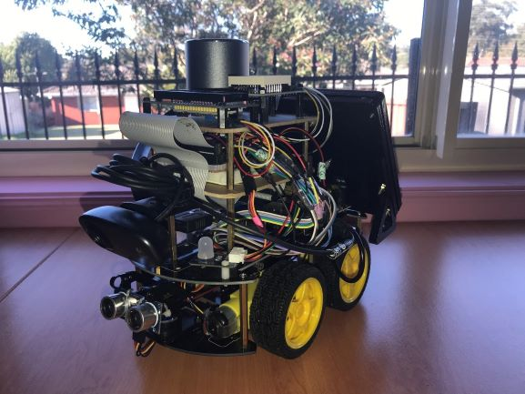
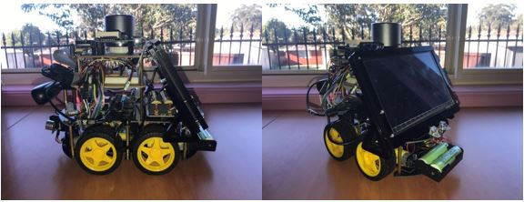
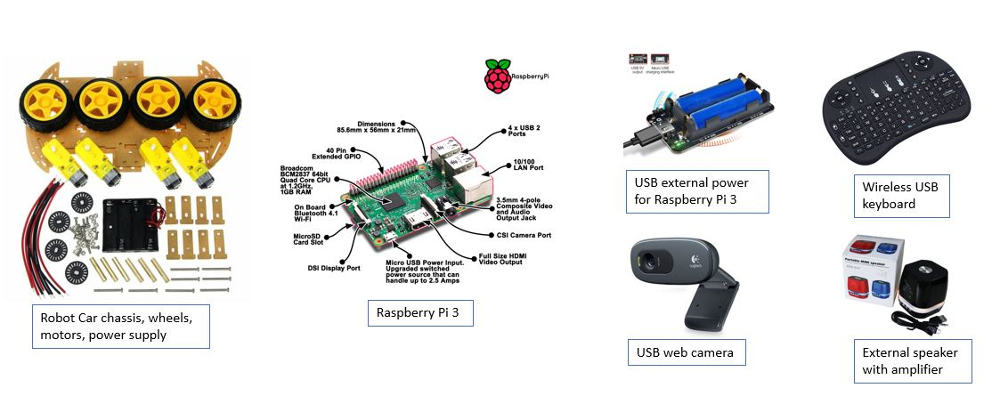
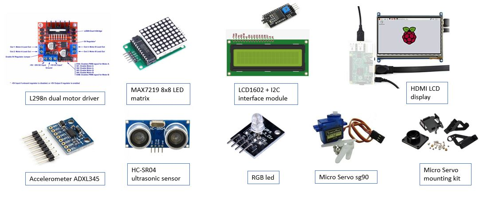
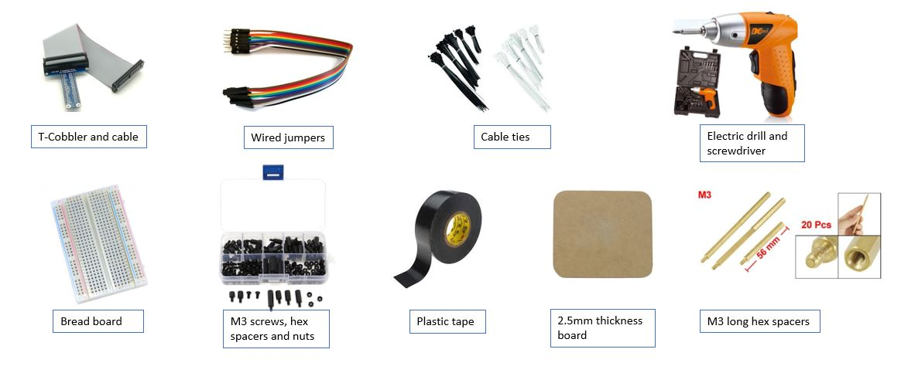
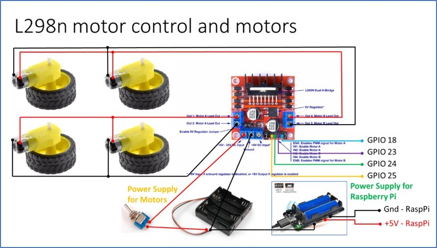
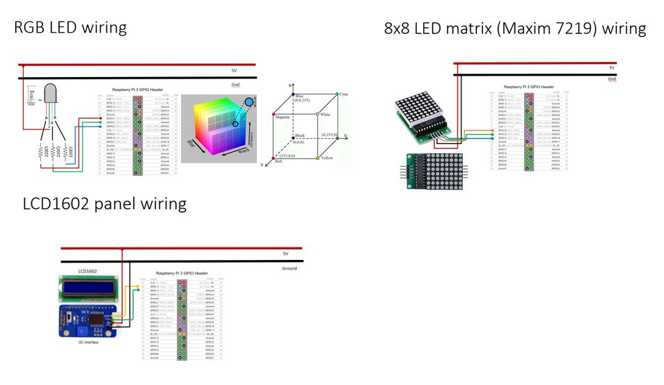
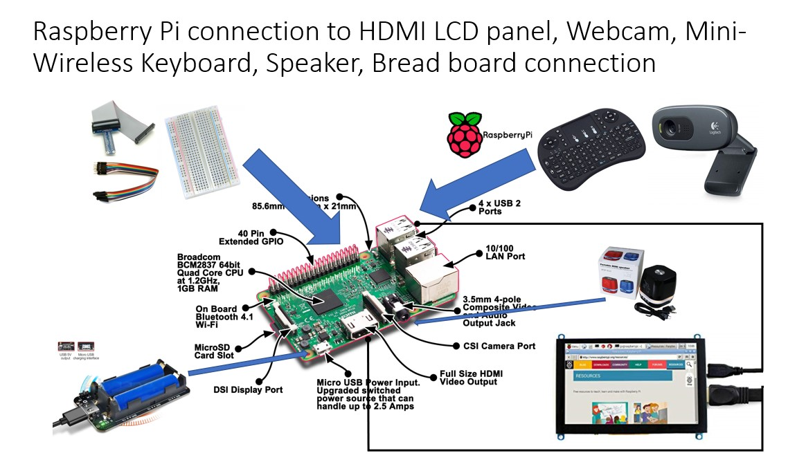

robot_car_s
## Robot Car (Raspberry Pi 3 - simple)

The objective of setup the Raspberry Pi Robot Car is to demonstrate
the use of Python language through Raspberry Pi to control robots, 
visual and audio responses and display information. 
Different types of common hardware are used to enable movement 
(motors and servo), computer vision (USB webcam), audio response 
(sound and speaker), display information (LED matrix and LCD display) 
and sensor to detect environment changes (distance sensor and accelerometer)




## Getting Started
**Physical setup (components):**
* Robot Car chassis, wheels, motors, power supply
 and circuit control board (L298N) for movement
* Single-board computer (Raspberry Pi 3) to 
run the Python program and control the Raspberry Pi Robot Car
* Separated Power supply for the robot car motors
* Separated Power supply for the Raspberry Pi 3
* Ultrasonic sensor (HC-SR04) to sense the distance
* Accelerometer (ADXL345) to sense the dips, humps, acceleration 
and deceleration
* Servo (sg90) micro-servo to move the HC-SR04 to scan the distance
 between the robot car and obstacles 
 * Mounting kit for the Servo
* RGB led display different colour (RGB led) to signal the status of the robot car
* 8x8 LED matrix (Maxim 7219) to display single character of scrolling message in LEDs
* 16x2 LCD display (lcd 1602 with i2c connection) to display message in 2 rows
* Logitech C310 webcam or equivalent that could be detected by Raspberry Pi 
for OpenCV (Computer Vision) in the future
* Mini-Speaker with amplifier for audio output in the future
* Bread board to connect related hardware together
* T-Cobbler connector and cable
* Wire Jumpers
* Mini On-Off Toggle switch
* 220 ohms resistors
* Mini-size wireless USB keyboard to enter commands in Raspberry Pi and 
control the Robot Car
* HDMI LCD display to show the Raspberry Pi desktop for easy calibration. 
We could use VNC to remote display the Raspberry Pi desktop also





**Wiring the Robot Car**






#### Installing

**Install Python libraries to support the hardware**

* **Install Max7219** python supporting library for Raspberry Pi
    Richard Hull. 2016. Raspberry PI MAX7219 driver. [ONLINE] Available at: 
    https://max7219.readthedocs.io/en/0.2.3/
    1. Follow either options to complete 'Step 1'
        * Option 1:
            > sudo apt-get install python3-dev python3-pip
        
            > sudo pip3 install max7219
        * Option 2:
            > git clone https://github.com/rm-hull/max7219.git
            
            > cd max7219
            
            > sudo pip3 install -e .
            
    2. Follow the specific steps below
        > cd max7219
        
        > sudo apt-get install python3-dev python3-pip
        
        > sudo pip3 install spidev
        
        > sudo python3 setup.py install
        
    3. Problem (if applicable): “No module named luma.led.matrix.device”
    
        Force reinstall of the “luma.led.matrix.device” module may need to do so
        > sudo -H pip3 install --upgrade --force-reinstall --ignore-installed luma.led_matrix
        
* **Install 16x2 LCD display (lcd1602)** python supporting library for Raspberry Pi
    Denis Pleic. 2015. RPi_I2C_driver.py [ONLINE] Available at: https://gist.github.com/DenisFromHR/cc863375a6e19dce359d
    
    Reference: http://www.circuitbasics.com/raspberry-pi-i2c-lcd-set-up-and-programming/
    > sudo apt-get update
    
    > sudo apt-get install i2c-tools
    
    > sudo apt-get install python3-smbus
    
    * Copy the Python driver codes from the link below and save as RPi_I2C_driver.py
    https://gist.github.com/DenisFromHR/cc863375a6e19dce359d/raw/36b82e787450d127f5019a40e0a55b08bd43435a/RPi_I2C_driver.py
     
* **Install Accelerometer (ADXL345) module** python supporting library for Raspberry Pi
    Tony DiCola. 2015. Adafruit_Python_ADXL345. [ONLINE] Available at:  
    https://github.com/adafruit/Adafruit_Python_ADXL345 
    * Follow either options to complete 'Step 1'
        * Option 1:
            > sudo apt-get install git build-essential python3-dev
            
            > cd ~
            
            > git clone https://github.com/adafruit/Adafruit_Python_ADXL345.git
            
            > cd Adafruit_Python_ADXL345
            
            > sudo python setup.py install
            
        * Option 2:
            > sudo pip3 install adafruit-adxl345
       
**Use test programs to confirm the Robot Car components are working**

* Use the following Python codes to test:
    * **key_test.py** to test the wireless USB keyboard press
    * **lcd1602_test.py** to test the lcd1602 with I2C connection display
    * **matrix_demo.py** to test the MAX7219 8x8 LED display
    * **motor_test.py** to test car left and right motors operation
    * **rgb_led.py** to test the RGB led display
    * **servo_test.py** to test the micro servo sg90 operation
    * **simpletest.py** to test the ADXL345 accelerometer the yaw-roll-pitch of the car
    * **ultrasonic_HC-SR04.py** to test the HC-SR04 ultrasonic sensor measuring distance

<p></p>

#### Prerequisites

What things you need to install the software and how to install them

```
Give examples
```


A step by step series of examples that tell you how to get a development env running

Say what the step will be

```
Give the example
```

And repeat

```
until finished
```

End with an example of getting some data out of the system or using it for a little demo

## Running the tests

Explain how to run the automated tests for this system

### Break down into end to end tests

Explain what these tests test and why

```
Give an example
```

### And coding style tests

Explain what these tests test and why

```
Give an example
```

## Deployment

Add additional notes about how to deploy this on a live system

## Built With

* [Dropwizard](http://www.dropwizard.io/1.0.2/docs/) - The web framework used
* [Maven](https://maven.apache.org/) - Dependency Management
* [ROME](https://rometools.github.io/rome/) - Used to generate RSS Feeds

## Contributing

Please read [CONTRIBUTING.md](https://gist.github.com/PurpleBooth/b24679402957c63ec426) for details on our code of conduct, and the process for submitting pull requests to us.

## Versioning

We use [SemVer](http://semver.org/) for versioning. For the versions available, see the [tags on this repository](https://github.com/your/project/tags). 

## Authors

* **Billie Thompson** - *Initial work* - [PurpleBooth](https://github.com/PurpleBooth)

See also the list of [contributors](https://github.com/your/project/contributors) who participated in this project.

## License

This project is licensed under the MIT License - see the [LICENSE.md](LICENSE.md) file for details

## Acknowledgments

* Hat tip to anyone whose code was used
* Inspiration
* etc

